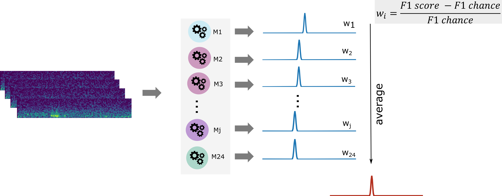

# AI-annotations for MGH data

### General info
REFERING TO THE PATIENTS' FOLDER FOUND HERE
<//Nexus2/RNS_DataBank/MGH/MGH>

The MGH data was annotated using the iESPnet. The resulting models after evaluting the net performance in the PITT data were used for running an emsable approach. 

### Annotation steps
The following steps were followed to make the annotations:

1. Spectrograms construction. 

Spectrograms were constructed following what was done for the PITT dataset, i.e., files shorter than 90 s were zeropadded. Files longer than 90 s were cut into non-overlapping segments of 90 s length.  

Source code: **/preprocessing/create_spectrograms_timelabel_zeropad.py**

Viz code: **/preprocessing/viz_gen_spec_timelabel_zeropad.py**

Script outputs: **Nexus2:/iESPnet/Data/RNS_Databank_Spectrograms/TimeLabelZeropadAll/MGH/

Name outputfile: <MGH_RNS####_#PE_E#.NPY>

2. Individual model prediction.

Given that 24 PITT patients were used to evaluate the net, 24 trained models are available to make the MGH predictions. Model prediction were made for every PE of every MGH patient, using every and each PITT trained model. The 24 outputs were saved to the make the final decision based on ensamble classifiers. 

Source code: <make_predictions_PE.py>

Script outputs: **Nexus2:/iESPnet/AnnotMGH/outputs/MGH-RNS####/results**

Name outputfile: MGH-RNS###results_pe_#PE_model_#MODEL.NPY

3. Create annot files.

The 24 models prediction were post-process to create the annotation files. The same exactly TXT annotations format files done the expert was followed. An ensemble bagging strategy was used to make the AI annotations. That is, the final output was constrcuted by weigthed averaging each model output (see Figure). 

Source code: <process_predictions.py>

Script outputs: **X:/RNS_DataBank/MGH/MGH/MGH-RNS###/iEEG/**

Name outputfile: <MGH-RNS###_#PE_EOF_SZ-AI.TXT>

4. Validate annot files

Validate iESPnet bagging detections by those made 

Source code: <validate_predictions.py>

Script outputs: **AIannotation_validation_expert.pdf**

#### documentation @Dec 2022.
#### Author: VPeterson
