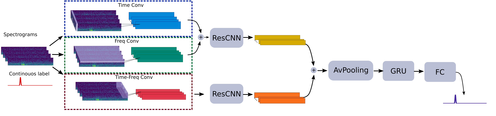

# Deep net detection and onset prediction of electrographic seizure patterns in responsive neurostimulation (iESPnet)
<p align="center">

</p>


## Installation guidelines
This guidelines are based on [Anaconda](https://www.anaconda.com/distribution/) distribution.
The library has been tested on Linux and Windows Server.

### Install requirements for reproducing the experiments
### Opt A: your PC, you know how to do this ;)
1. Create conda environment
```
conda env create -f environment.yml
```
2. Activate conda environment
```
conda activate sz_cnn_torch
```
3. Install [pytorch](https://pytorch.org/get-started/locally/) 
4. Check torch is installed. If Error (ImportError: DLL load failed: The operating system cannot run %1), run 
```
conda install -c defaults intel-openmp -f
```

### Opt B: BML Turbo-server (yeah, your are welcome!)
1. make sure anaconda o miniconda are installed for you. How to know that? in the search icon just write "anaconda" and it should appear "anaconda prompt". if not installed, I recommend you to install miniconda
2. go to Nexus2:\iESPnet\env
3. open a git bash terminal on that folder, i.e. right click and select "Git Bash here"
4. on the git bash terminal write the following:
``` 
conda env create -f environment.yml
```
5. activate the environment: 
```
conda activate sz_cnn_torch
```
6. install pytorch: 
```
pip3 install torch==1.9.1+cu111 torchvision==0.10.1+cu111 torchaudio===0.9.1 -f https://download.pytorch.org/whl/torch_stable.html
```
7. close that terminal
8. open a conda terminal (in the search button write anaconda o miniconda, this will depend on the chose you made in step 1)
9. activate the environment:
```
conda activate sz_cnn_torch
```
10. open Spyder: Spyder&
11. run the example code! BUT WE SURE THE address are accurate for you too! I cannot know that before hand, so check that!
TIP: The code will run faster if you have a local copy of the data. Do this, believe me ;)

## Content
### Utilities
Customized functions used to read data, transform data and so on. Most relevant ones for running the below described codes are:

<Model.py>, Pythorch implementation of the iESPnet. 
<TrainEval.py>, customized fuction used for training, evaluating  and testing the model. See this function for a description of the content. 

## Scripts list:
<example_run_train_test_LOSO.py>, an example of how to traing the model and then evaluated in unseen testing data. Note that this example does not use validation set. And train the model up to 20 epochs are reached. 
This is how was done on the experiments reported in the paper. For other types of training and evaluation please see the option you have in ''TrainEval.py''
Part of the outputs of this script are the subject-based model. The saved model can be found in 

''Nexus2:/iESPnet/Models/PITT/PIT-RNS####''

<create_singlemodel_model.py>, a single model is trained using the 24 annotated PITT patients data. Output of this script is a single model ready to make predictions. The saved model can be found in 

''Nexus2:/iESPnet/Models/single_model/model_opt.pth''


For more information on how the spectrograms were constructed please refer to the **Preprocessing** folder. 
#### documentation @Feb 2022. Updated @Dec 2022
#### Author: VPeterson
